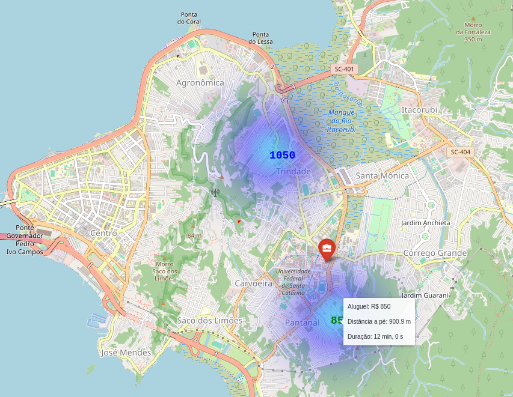

# How to use
## Addresses
Place addresses in file `inputs/addresses.csv` inside this subdirectory with the following format:

```csv
Address;Region;Rent;URL
Maria Eduarda, 95, Florianópolis;Pantanal;850;https://google.com
Rua José Dutra, 10, Florianópolis;Trindade;1050;https://google.com
```


## Work Coordinates
Place the coordinates in `inputs/work_coordinates.csv` to be able to compute the distance beetween this location and those from the addresses previously given. The coordinates inside the file must be given as follows:

```csv
Latitude;Longitude
-27.600886;-48.5176787
```

**Note:** Both input files must be `;` separated

## Result


